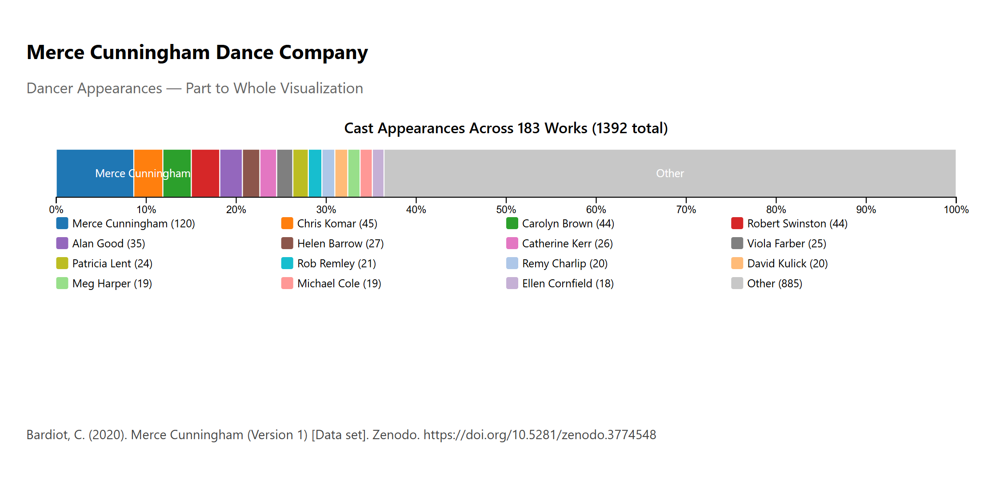

# Cunningham Part-to-Whole

This archived learning experiment was created as part of Jeremiah King's 2026 [#30DayChartChallenge](https://30daychartchallenge.org/) Cunningham visualization series. The specific challenge day and prompt have not been recovered.

## What the experiment attempted

The project explored whether credited names in Cunningham work records could be summarized in a single 100% stacked bar using the 15 most frequent names plus an `Other` category. It used repeated name-work relationships, pointer-displayed percentages, React, D3, and SVG.

## Why it is archived

The visualization was originally described as showing shares of "total performances" and as representing dancer appearances. The source instead records 183 works and their original or premiere credits, not a complete performance history. The implemented metric is best described as parsed name-work memberships derived primarily from original or premiere cast credits, subject to the limitations below.

## Analytical limitations

A separately preserved dancer roster contains 162 names. The parser produces 220 distinct credited-name strings, 69 of which are not present on that roster and account for 209 memberships. Conversely, 11 rostered dancers receive no memberships because they do not appear in the recorded original or premiere casts. This confirms that the chart aggregates work-credit relationships rather than general dancer appearances.

On rows that begin a work, the parser reads only `Original cast`; on continuation rows, it reads both `Music` and `Original cast`. This causes 18 music-credit relationships, representing 10 composer strings, to enter the pooled names and fall within `Other`. The displayed denominator is therefore 1,392 memberships rather than 1,374 cast-work memberships. The named top-15 counts are unaffected, while `Other` is displayed as 885 instead of the cast-only value of 867.

The top-15 cutoff also falls inside a four-way tie at 18 memberships. Ellen Cornfield is retained as the fifteenth named category, while Victoria Finlayson, Kimberly Bartosik, and Lisa Boudreau—each also at 18—are folded into `Other`. Because the code uses a fixed `slice(0, 15)` after a stable sort, source encounter order determines which tied name occupies the final named position.

Names are matched as exact strings without identity normalization, so source spelling or name variants may remain split.

**This repository is retained as a historical visualization-learning artifact rather than as a current analytical result.**

## Data provenance

The source dataset is:

> Clarisse Bardiot. *Merce Cunningham*. Version 1. Zenodo. [doi:10.5281/zenodo.3774548](https://doi.org/10.5281/zenodo.3774548).

The dataset is licensed under [Creative Commons Attribution 4.0 International (CC BY 4.0)](https://creativecommons.org/licenses/by/4.0/).

The tracked [`src/data/cunningham.tsv`](src/data/cunningham.tsv) is byte-identical to Zenodo's `donnees-cunningham.csv` (MD5 `2fa9f8a4ab76d5a8c3fe163aa11e1709`). The local extension reflects that the source file is tab-delimited; its contents were not rewritten.

No separate license is currently specified for the application software.

## Series context

The principal project in the Cunningham series is [`cunningham-3d`](https://github.com/unguisdraconis/cunningham-3d). Stronger retained supporting experiments include [`cunningham-marimekko`](https://github.com/unguisdraconis/cunningham-marimekko), [`cunningham-slope`](https://github.com/unguisdraconis/cunningham-slope), and [`cunningham-pictogram`](https://github.com/unguisdraconis/cunningham-pictogram).
